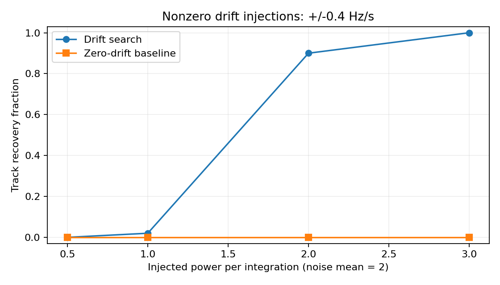
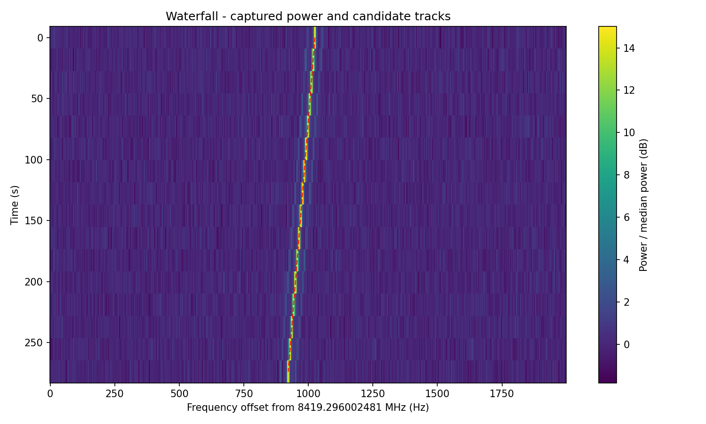

# Signal pipeline validation

## Question and scope

How does integrating along linear frequency-drift tracks affect recovery of
injected narrowband signals relative to a stationary-frequency baseline?
Can the same unit-aware pipeline recover the known Voyager 1 carrier in the
public Berkeley Green Bank Telescope tutorial dataset?

This report records executed computational experiments. It is a small engineering
validation and tutorial reproduction, not a peer-reviewed study, new discovery,
or proof of research independence. Implementation, tests, and analysis were
prepared with AI assistance for review by the project owner.

## Corrections from the original version

1. The former 20 MHz / 2048-bin simulation had approximately 9766 Hz channels;
   a 0.4 Hz/s signal moved only 102 Hz across 256 integrations and never changed
   bin. The new default is 512 one-Hz channels and 128 one-second integrations.
2. The original score subtracted a power median as if it were an expectation.
   For the simulated exponential noise the median is below the mean. The new
   score subtracts each row's empirical mean and uses the sum of row variances.
3. SDR timestamps now derive from sample count / sample rate. The earlier code
   labeled adjacent 2048-sample frames as one second apart despite a 2.048 MS/s
   sample rate. Device cleanup now runs even if capture raises an exception.
4. Frequency centers and telescope time spacing come from source axes/headers.
   Descending telescope channels are reversed together with their power data.
5. The search grid has at most one-bin endpoint spacing. Candidate suppression
   checks proximity at both track endpoints; the core search vectorizes starting
   channels instead of nesting Python loops over starting channel and drift.

## Method

For each candidate track, subtract the measured mean power of each row, sum the
excess power along nearest-channel samples, and divide by the square root of the
sum of the row variances. Retain scores above 6 with at least 80% in-band coverage.
The score threshold is an algorithm setting, not a six-sigma false-alarm claim.
Noise parameters estimated from the observation can be biased by signals,
structured bandpass, and RFI. Correlated trial tracks invalidate naive Gaussian
multiple-testing interpretations.

The baseline is the same implementation with only zero drift. It isolates the
benefit of tracking a moving tone; it is not a comparison with a state-of-the-art
radio-astronomy package. Both methods use the same threshold, so their different
numbers of trials produce different observation-level false-alarm rates.

## Synthetic design

- Shape: 64 time steps x 256 frequency channels; 1 s and 1 Hz spacing.
- Noise: independent chi-square with 2 degrees of freedom, mean 2 and standard
  deviation 2, plus a constant additive nearest-bin signal.
- Signal strengths: 0.5, 1, 2, and 3 added power units per time step.
- Drifts: -0.4, 0, and +0.4 Hz/s; 25 seeds per combination (1000-1024).
- Noise-only controls: 100 independent seeds (5000-5099).
- Recovery: the strongest candidate's first and last track coordinates must both
  lie within two channels of the injected track. A crossing track is insufficient.
- The same seeds are reused across conditions for paired comparisons; conditions
  therefore are not independent experiments. No threshold tuning on these
  evaluation seeds was performed after inspecting their results.

### Results: 300 injected observations

| Added power | Drift (Hz/s) | Drift search recovered | Stationary baseline recovered |
|---:|---:|---:|---:|
| 0.5 | -0.4 | 0/25 | 0/25 |
| 0.5 | 0 | 0/25 | 0/25 |
| 0.5 | +0.4 | 0/25 | 0/25 |
| 1 | -0.4 | 1/25 | 0/25 |
| 1 | 0 | 0/25 | 0/25 |
| 1 | +0.4 | 0/25 | 0/25 |
| 2 | -0.4 | 22/25 | 0/25 |
| 2 | 0 | 25/25 | 25/25 |
| 2 | +0.4 | 23/25 | 0/25 |
| 3 | -0.4 | 25/25 | 0/25 |
| 3 | 0 | 25/25 | 25/25 |
| 3 | +0.4 | 25/25 | 0/25 |

At power 2, the drift search recovered 45/50 nonzero-drift injections; at power 3,
50/50. Weak injections were mostly missed. For recovered moving tracks, the
median absolute drift error in each condition was approximately 0.003175 Hz/s.
This is conditional on successful recovery, not an error estimate for all trials.
A 25/25 result has a Wilson 95% interval of approximately 86.7%-100%, not certainty
of perfect detection outside this sample.



### Noise-only controls and runtime

- Drift search: **1/100 observations** returned a candidate (1%; Wilson 95% interval
  approximately **0.18%-5.45%**).
- Stationary baseline: **0/100** (Wilson 95% interval **0%-3.70%**).
- Median runtime over all 400 observations in this execution environment:
  **0.0399 s** for drift search and **0.000424 s** for the stationary baseline.
  These are local timings, not hardware-independent performance claims.

The synthetic generator and detector share a nearest-bin straight-line model,
which makes these tests favorable. They do not establish performance on drifting
signals with spectral leakage, scintillation, acceleration changes, or RFI.

Every trial, including misses and false positives, is in
[trials.json](synthetic/trials.json); per-condition confidence intervals and
configuration are in [summary.json](synthetic/summary.json).

## Known Voyager carrier: real telescope data

Source: [UC Berkeley blimpy Voyager tutorial](https://github.com/UCBerkeleySETI/blimpy/blob/master/examples/voyager.ipynb).
The tutorial identifies a carrier around 8419.296-8419.298 MHz. The selection was
specified before the search; this is not blind source localization.

Dataset: `Voyager1.single_coarse.fine_res.h5`, downloaded from the tutorial's
[Berkeley URL](http://blpd0.ssl.berkeley.edu/Voyager_data/Voyager1.single_coarse.fine_res.h5).

SHA256: `c9a9a54f4140e3754ffb2455fae4eeb2eb70c8207123116ee953e4fce15c36ac`.

| Measurement | Result |
|---|---:|
| Selected data shape | 16 integrations x 716 channels |
| Channel spacing | 2.793967724 Hz |
| Integration spacing | 18.253611008 s |
| First-to-last integration separation | 273.80416512 s |
| Search range | +/-4 channels/integration |
| Strongest track start frequency | 8419.297027867 MHz |
| Strongest track drift | -0.377557462 Hz/s |
| Excess-power score | 71.4505 |
| Zero-drift baseline above threshold | None |
| Per-row peak ridge fitted drift | -0.374106023 Hz/s |
| Ridge-fit residual RMS | 1.14524 Hz |

The drift differs from the per-row peak linear fit by approximately 0.00345 Hz/s,
within a two-channel endpoint tolerance of 0.02041 Hz/s. That is a same-data
consistency check, not independently measured truth or a physical uncertainty.
The routine retained 50 overlapping candidate tracks around this bright feature;
**50 tracks do not mean 50 sources**. The plot shows only the strongest track.



Full measurements and limitations: [validation.json](voyager/validation.json).
The generic CLI record is retained in [run.json](voyager/run.json).

## Verification and reproduction

Run in a clean Python 3.12 virtual environment:

```bash
pip install -r requirements-validation-lock.txt
python -m pytest -q
python scripts/benchmark.py --seeds 25 --noise-seeds 100
python scripts/validate_voyager.py --download
python src/app.py --seed 42
```

The dependency lock records the versions used here. Tests exercise positive,
negative, zero and off-grid drift; resolvable injection; noise and zero-variance
inputs; coverage rejection; invalid arrays; sample-clock SDR timing with a fake
device; actual HDF5 header loading using a synthetic fixture; plotting; web
requests; and CLI JSON output. The real dataset is fetched separately and is not
required for the offline unit tests.

## What remains unverified

- Physical RTL-SDR reception, RF calibration, sample drops, and satellite passes.
- Performance on other telescope observations, realistic RFI, masked channels,
  nonlinear drift, multi-polarization data, and weak real signals.
- Real-data false-alarm calibration and precision/recall on a labeled blind set.
- Scalability to full survey bandwidths; optimized dedoppler algorithms are needed.
- Live LLM answers, image-caption reliability, and RAG retrieval accuracy; no paid
  model calls were made. CLI run logs can be indexed, but ingestion must be rerun.

## Next research steps

1. Have a mentor review units, noise assumptions, and candidate matching.
2. Add a separate held-out real-background dataset and injected-signal tests with
   spectral leakage; predefine thresholds and score the test set once.
3. Compare with an established dedoppler implementation at matched false-alarm
   rates, then investigate disagreements rather than just matching one example.
4. Reproduce these results personally and explain the signal model, baseline,
   failures, and limitations before presenting this as research experience.
